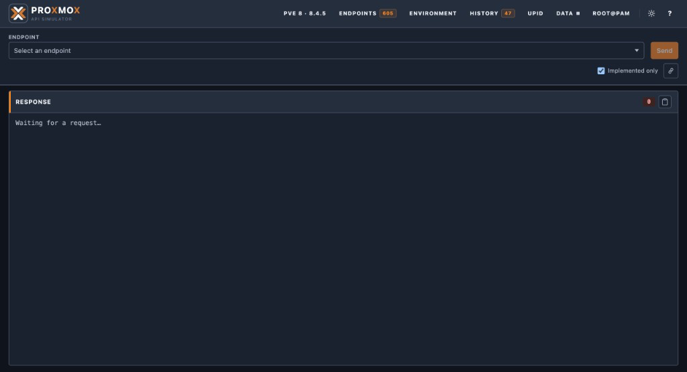

**Language / Язык:** [English](README.md) | [Русский](README.ru.md)

# proxmox-api-simulator

Stateful asynchronous [Proxmox VE](https://www.proxmox.com/) API simulator for
testing API clients and infrastructure tooling without a real hypervisor
cluster.

> **Laboratory / CI only.** Default credentials, signing keys, and open UI/admin
> helpers are intentional lab defaults. Do **not** expose this stack to the
> public Internet without replacing secrets and adding your own controls.
> See [SECURITY.md](SECURITY.md) and [Security](docs/security.md).

The simulator is backed by PostgreSQL, driven by imported official API
contracts, and exposes the same `/api2/json` and `/api2/extjs` surfaces as
Proxmox VE. Semantic handlers persist mutations; long-running work returns
durable UPIDs executed by leased task workers.

## Verified API coverage

Handler registry and verified surface ledgers are **100%** for every bundled major:

| Contract | Declared | Implemented | Verified |
|---|---:|---:|---:|
| PVE 6.4-15 | 504 | 504 | 504 |
| PVE 7.4-16 | 540 | 540 | 540 |
| PVE 8.4.5 | 605 | 605 | 605 |
| PVE 9.2.3 | 675 | 675 | 675 |

Switch the active contract at runtime from the Web UI (**Apply as runtime**) or
`POST /ui/api/contract/apply?major=N` — each Apply loads
`evidence/pve-{version}.json` so observed/verified scores follow the selected
major. Regenerate ledgers after importing a new contract with `make evidence`.
Live reports: `/admin/compatibility` (also `.md` / `.html`). See
[Compatibility](docs/compatibility.md) and [API versions](docs/api-versions.md).

> This is measurable contract and handler coverage for a laboratory simulator —
> not a claim that every Proxmox edge case or remote integration behaves
> identically to production hardware.

## Quick start (published image)

Image: [`inecs/proxmox-api-simulator`](https://hub.docker.com/r/inecs/proxmox-api-simulator)

### Docker Compose

Needs a checkout that includes `docker-compose.release.yml`. Do not publish host
`:8006` beyond a trusted lab without rotating `TICKET_SIGNING_KEY` / DB password.

```bash
docker compose -f docker-compose.release.yml up -d
docker compose -f docker-compose.release.yml run --rm --entrypoint python \
  simulator -m app.simulation.seed_cli

curl -sS http://localhost:8006/health/ready
curl -sS http://localhost:8006/api2/json/version
```

Or: `make release-up && make release-seed PROFILE=small`

### Helm (Kubernetes + Ingress + Let's Encrypt)

```bash
helm upgrade --install pve-sim ./helm/proxmox-api-simulator \
  -n proxmox-sim --create-namespace \
  -f ./helm/proxmox-api-simulator/values-ingress-example.yaml \
  --set certManager.email=you@example.com \
  --set ingress.hosts[0].host=pve-sim.example.com \
  --set ingress.tls[0].hosts[0]=pve-sim.example.com \
  --set secret.ticketSigningKey="$(openssl rand -hex 32)" \
  --set postgresql.auth.password="$(openssl rand -hex 16)"
```

Requires an Ingress controller and cert-manager. The chart Service speaks
**HTTP** `:8006`; TLS terminates at Ingress. Compose also serves plain HTTP on
`:8006`; optional HTTPS for proxmoxer-style clients is
`docker compose --profile tls` on host `:8443`. Details:
[Kubernetes / Helm](docs/kubernetes.md).

- HTTP API and Web UI (Compose): [http://localhost:8006/](http://localhost:8006/)
- FastAPI schema docs: [http://localhost:8006/docs](http://localhost:8006/docs)
- Default seeded admin: `root@pam` / `secret`

## Quick start (development checkout)

Build and run the bind-mounted development stack from this repository:

```bash
make install
make up
make seed PROFILE=small

curl -sS http://localhost:8006/health/ready
curl -sS http://localhost:8006/api2/json/version
curl -sS -X POST -d 'username=root@pam&password=secret' \
  http://localhost:8006/api2/json/access/ticket
```

- HTTP API and Web UI: [http://localhost:8006/](http://localhost:8006/)
  (real PVE uses **HTTPS** on `:8006`; this lab uses plain HTTP on the same
  port. Optional TLS for proxmoxer: `docker compose --profile tls` →
  `https://localhost:8443/`)
- Port map and TLS notes: [Ports and TLS](docs/configuration.md#ports-and-tls).
- FastAPI schema docs: [http://localhost:8006/docs](http://localhost:8006/docs)

### Web UI

Interactive console with light/dark themes, endpoint catalog for PVE 6–9,
runtime contract hot-swap, and a UPID task monitor.



More screens and details: [Web UI](docs/web-ui.md).

## Documentation

Documentation is bilingual. Use the **Language / Язык** switcher at the top of
each page, or open the Russian root [README.ru.md](README.ru.md). Index:
[docs/README.md](docs/README.md) · [docs/ru/README.md](docs/ru/README.md).

| Guide | Description |
|---|---|
| [Getting started](docs/getting-started.md) | First successful lab session |
| [Configuration](docs/configuration.md) | Environment variables and Compose |
| [Authentication](docs/authentication.md) | Tickets, CSRF, API tokens, ACLs |
| [API versions](docs/api-versions.md) | Contracts 6–9 and hot-swap |
| [Clients & examples](docs/clients.md) | Python, Go, Java, Perl, Ansible, Terraform, Pulumi |
| [Seed profiles](docs/seed-profiles.md) | Deterministic cluster fixtures |
| [API surface](docs/api-surface.md) | Routing, handlers, fallbacks |
| [Domains](docs/domains/README.md) | QEMU, LXC, storage, HA, SDN, … |
| [Web UI](docs/web-ui.md) | Interactive console and catalogs |
| [Operations](docs/operations.md) | Migrate, reseed, upgrade |
| [Kubernetes / Helm](docs/kubernetes.md) | Hub image + Ingress + Let's Encrypt |
| [Security](docs/security.md) | Lab threat model and credentials |
| [Observability](docs/observability.md) | Health endpoints and logging |
| [Troubleshooting](docs/troubleshooting.md) | Common failure modes |
| [FAQ](docs/faq.md) | Short answers |
| [Architecture](docs/architecture.md) | Component boundaries |
| [Compatibility](docs/compatibility.md) | Evidence model and release matrix |

Runnable cookbooks live under [`examples/`](examples/README.md).
Pulumi integration suite (contract surface majors 6–9 + lifecycle, HTML report):
[`pulumi-tests/`](pulumi-tests/README.md) (`make pulumi-tests`).

## proxmoxer (HTTPS gateway)

```python
from proxmoxer import ProxmoxAPI

proxmox = ProxmoxAPI(
    "localhost",
    port=8006,
    user="root@pam",
    password="secret",
    verify_ssl=False,  # local self-signed development certificate only
)
print(proxmox.version.get())
print(proxmox.nodes("pve01").qemu.get())
```

API token example: user `root@pam`, `token_name="automation"`,
`token_value="automation-secret"`. Token requests do not need CSRF; ticket
mutations do.

## Common Make targets

```bash
make up / make down / make logs / make dev
make test                 # unit + contract (includes verified surface)
make test-integration     # PostgreSQL-backed
make test-surface         # all verbs × majors 6-9 (0x501 / 0xexception)
make test-compatibility   # proxmoxer against Compose
make evidence             # regenerate evidence/pve-*.json ledgers
make seed PROFILE=small
make db-migrate
make shell
make ci                   # ruff + mypy + offline pytest + surface probe
make release              # build + push runtime image to Docker Hub
make release-up           # pull/start docker-compose.release.yml
make release-seed PROFILE=small
```

Docker Hub release (requires `docker login` as the Hub owner; see
[Operations](docs/operations.md)):

```bash
make release                          # inecs/proxmox-api-simulator:<pyproject version> + :latest
make release VERSION=0.2.0            # override tag
make release-build                    # build/tag only, no push
make release-up && make release-seed  # run the published stack locally
```

## Contributing / security / changelog

- [CONTRIBUTING.md](CONTRIBUTING.md) · [CONTRIBUTING.ru.md](CONTRIBUTING.ru.md)
- [Testing](docs/testing.md) · [Тесты](docs/ru/testing.md) — suites, Make targets, latest results
- [SECURITY.md](SECURITY.md)
- [CHANGELOG.md](CHANGELOG.md)

## What this is not

- Not a hypervisor: no KVM/LXC execution on bare metal or nested hosts.
- Not a drop-in multi-tenant production Proxmox replacement.
- Remote IdP / LDAP / live Ceph / live ACME directories are simulated locally;
  they do not call real external systems.

## See also

- [Web UI](docs/web-ui.md) — interactive console, catalogs, DATA panel, and screenshots
