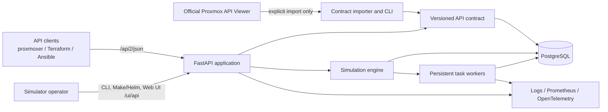
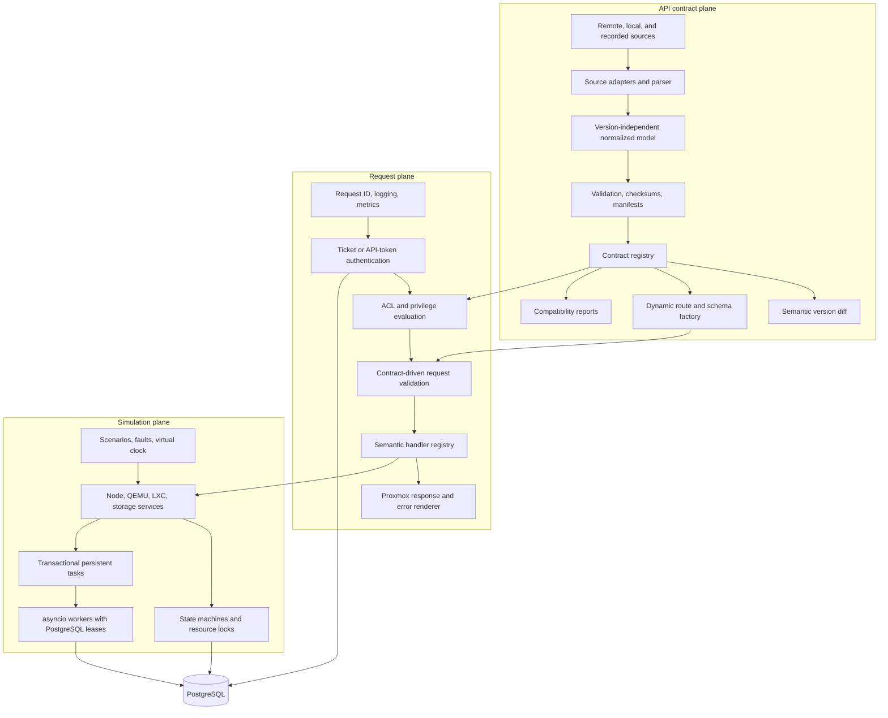

**Language / Язык:** [English](architecture.md) | [Русский](ru/architecture.md)

# Architecture

## Goals

`proxmox-api-simulator` is a stateful, asynchronous Proxmox VE API emulator. Its
primary design goal is measurable contract compatibility: routes, validation,
authentication, permissions, response shapes, state transitions, and persistent
long-running tasks are verified independently instead of being described as
universally compatible. Bundled majors **6–9** ship with **100%** semantic
handler registration for every declared contract method, with runtime hot-swap
between those majors.

The simulator does not require a live Proxmox installation during normal
operation. Official API artifacts and sanitized observations are imported ahead
of time and stored as versioned snapshots.

## System context

## Component architecture

## Boundaries and dependency direction

The contract plane owns declared API facts. It imports source artifacts, retains
unknown source fields, produces deterministic normalized JSON, and exposes
immutable versioned contracts. It does not know about VM state or execute
operations.

The simulation plane owns mutable cluster state and operation semantics. It uses
domain models and repositories that do not depend on FastAPI or source-specific
contract structures. PostgreSQL is the system of record for resources, security
state, locks, scenarios, and tasks.

Durable tasks are acknowledged only after the task row, event, idempotency key,
and optional resource lock commit together. Workers claim with `SKIP LOCKED`,
renew real-time leases, persist progress and append-only logs/events, and allow
expired work to be reclaimed after process failure. Lifespan owns a bounded set
of asyncio workers and waits for orderly shutdown; PostgreSQL remains the queue
and source of truth across replicas.

Simulation durations use injected real, accelerated, or manually advanced
clocks. VM operations are explicit state-machine transitions, and seeded fault
rules evaluate deterministically. Worker leases are intentionally excluded from
virtual time: they use PostgreSQL wall time and process monotonic sleeps so a
paused or accelerated scenario cannot invalidate distributed-worker safety.

Authentication secrets use salted scrypt hashes. Session tickets are signed and
expiring; mutation requests use ticket-bound CSRF tokens. API-token privileges
are intersected with their owning principal's effective propagated ACLs, so a
token cannot escalate its owner. Logs redact recognized ticket, password, and
token representations before emission.

The API layer is an adapter. It authenticates, authorizes, validates against the
selected contract, dispatches to a semantic handler, and renders a
version-compatible response. A route without a semantic handler is explicitly
reported as unsupported unless an operator enables a non-default fallback mode.

Dependencies point inward: HTTP and CLI adapters depend on application services;
application services depend on domain interfaces; PostgreSQL, contract files,
metrics, and clocks implement those interfaces. Domain services never import
FastAPI.

## Request lifecycle

1. Middleware assigns or validates a request ID and starts safe structured
   telemetry.
2. The selected compatibility profile resolves an immutable API snapshot and
   version-specific behavior.
3. Authentication resolves a principal without exposing credentials in logs.
4. Contract-declared and handler-specific permissions are evaluated before
   revealing or mutating resources.
5. Path, query, and body values are validated by contract-derived schemas.
6. The semantic handler executes through an application service and explicit
   transaction boundary.
7. Long operations atomically update the resource lock and create a persistent
   task, then return its UPID.
8. The response renderer applies the Proxmox envelope, headers, cookies, and
   version-specific error templates.

## Persistence and concurrency

`asyncpg` is used directly. Repositories accept an explicit connection or
transaction context; SQL is parameterized and kept near its repository. Mutable
process globals are not authoritative state.

Workers claim tasks using `FOR UPDATE SKIP LOCKED`, establish renewable leases,
and use idempotency metadata to recover after process failure. Resource state,
resource locks, and task creation are changed in one transaction when required.
Optimistic version columns detect concurrent updates, while database constraints
protect invariants such as VMID uniqueness within a cluster.

Application lifespan owns the connection pool and bounded asyncio worker tasks.
Shutdown stops claims, lets in-flight work reach a safe boundary, cancels only
after a configured grace period, and closes the pool.

## Contract acquisition and trust

Network access is confined to explicit import and recorder commands. Importers
enforce HTTPS, an official-host allowlist by default, response-size and redirect
limits, timeouts, and bounded retries. Every raw artifact is immutable and has a
SHA-256 checksum. Its manifest records provenance, version, parser warnings, and
normalized checksum. Local snapshots keep startup and tests offline.

Declared documentation and sanitized observed behavior remain distinct. A
compatibility profile chooses `strict-docs`, `observed`, or `hybrid` behavior
without scattering version checks through services.

## Security model

- Passwords and API-token secrets are stored only as password hashes.
- Tickets are signed, short-lived, and redacted from telemetry.
- Ticket-authenticated mutations require CSRF validation; API-token requests do
  not require CSRF.
- The interactive Web UI and `/admin/compatibility*` helpers are laboratory
  surfaces without a separate admin token in the current build — network
  exposure is the trust boundary.
- Containers run as a non-root user in the packaged images.

## Runtime contract hot-swap

Cold start loads `CONTRACT_SNAPSHOT`. Operators can replace the in-memory route
table for majors 6–9 via `POST /ui/api/contract/apply?major=N` (also exposed in
the Web UI). The swap refreshes `/version`, OpenAPI, and compatibility state and
is process-local (restart restores the env snapshot).

## Observability

JSON logs contain request ID, route template, status, duration, and redacted
identity fields. Process Prometheus/OpenTelemetry exporters are not shipped yet;
Proxmox `/cluster/metrics*` handlers simulate PVE metrics-server configuration
only.

## Testing strategy

Unit tests cover contract processing and domain rules. Integration tests
exercise repositories, transactions, workers, and lifespan against PostgreSQL.
Contract and compatibility suites target majors **6–9** with **100%** handler
registry coverage. External proxmoxer smoke runs against the Compose TLS
gateway. Concurrency tests target task leases and state transitions.

Database readiness includes the latest packaged migration version, not merely a
successful connectivity query. Workers retry failed claims until migration
tables exist. Normalized resource writes use compare-and-swap version updates
through a typed repository, so stale writers receive a domain conflict.

## Deployment model

One Uvicorn process runs per container. Horizontal replicas coordinate through
PostgreSQL rather than local queues. Database migrations and seed operations are
explicit commands and become separate jobs in Kubernetes. PostgreSQL is included
in local Docker Compose but is an external dependency in the production chart.

## Architectural decisions

1. FastAPI routes are registered from normalized snapshots at startup; hundreds
   of hand-maintained route declarations are avoided.
2. SQLAlchemy is not used. Direct asyncpg repositories keep transaction and
   concurrency behavior explicit.
3. PostgreSQL-backed tasks are the durability boundary; FastAPI background tasks
   and in-memory queues are not used for critical work.
4. Compatibility is capability-driven and versioned, not implemented through
   scattered version string conditions.
5. Missing handlers fail honestly via `CONTRACT_FALLBACK` (default `error` →
   HTTP 501). Majors 6–9 ship with full handler registration, so declared
   methods should not hit that path under normal operation.
6. Laboratory docs and cookbooks live under `docs/` and `examples/`; internal
   research/prompt notes are not part of the user guide.
