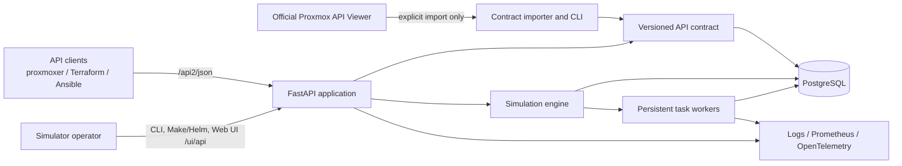
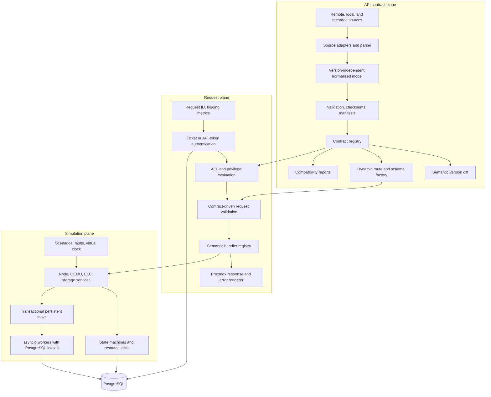

**Language / Язык:** [English](../architecture.md) | [Русский](architecture.md)

# Архитектура

## Цели

`proxmox-api-simulator` — stateful асинхронный эмулятор Proxmox VE API. Главная
цель проектирования — измеримая совместимость с контрактом: маршруты, валидация,
аутентификация, права доступа, формы ответов, переходы состояния и персистентные
долгоживущие задачи проверяются независимо, а не объявляются «универсально
совместимыми». В комплекте majors **6–9** поставляются с **100%** регистрацией
семантических обработчиков для каждого объявленного метода контракта и поддержкой
горячей замены между этими majors во время работы.

Для обычной работы симулятору не нужна живая установка Proxmox. Официальные
артефакты API и санитизированные наблюдения импортируются заранее и хранятся как
версионируемые снимки.

## Контекст системы

## Архитектура компонентов

## Границы и направление зависимостей

Плоскость контракта владеет объявленными фактами API. Она импортирует
исходные артефакты, сохраняет неизвестные поля источника, формирует
детерминированный нормализованный JSON и предоставляет неизменяемые
версионируемые контракты. Она не знает о состоянии ВМ и не выполняет операции.

Плоскость симуляции владеет изменяемым состоянием кластера и семантикой
операций. Она использует доменные модели и репозитории, не зависящие от FastAPI
и структур контракта, специфичных для источника. PostgreSQL — система записи
для ресурсов, состояния безопасности, блокировок, сценариев и задач.

Долговечные задачи подтверждаются только после совместной фиксации строки задачи,
события, ключа идемпотентности и опциональной блокировки ресурса. Воркеры
захватывают задачи через `SKIP LOCKED`, продлевают аренды в реальном времени,
сохраняют прогресс и append-only логи/события и позволяют повторно захватить
просроченную работу после сбоя процесса. Lifespan владеет ограниченным набором
asyncio-воркеров и ждёт упорядоченного завершения; PostgreSQL остаётся очередью
и источником истины между репликами.

Длительности симуляции используют внедрённые часы: реальные, ускоренные или
продвигаемые вручную. Операции ВМ — явные переходы конечного автомата, а
засеянные правила сбоев оцениваются детерминированно. Аренды воркеров намеренно
исключены из виртуального времени: они используют wall time PostgreSQL и
monotonic sleep процесса, чтобы приостановленный или ускоренный сценарий не
нарушил безопасность распределённых воркеров.

Секреты аутентификации хранятся как salted scrypt-хеши. Сессионные тикеты
подписаны и имеют срок действия; мутационные запросы используют CSRF-токены,
привязанные к тикету. Привилегии API-токена пересекаются с эффективными
распространёнными ACL владельца-принципала, поэтому токен не может эскалировать
права владельца. Логи редактируют распознанные представления тикетов, паролей и
токенов перед записью.

API-слой — адаптер. Он аутентифицирует, авторизует, валидирует по выбранному
контракту, диспетчеризует семантический обработчик и формирует
версионно-совместимый ответ. Маршрут без семантического обработчика явно
сообщается как неподдерживаемый, если оператор не включил нестандартный режим
fallback.

Зависимости направлены внутрь: HTTP- и CLI-адаптеры зависят от прикладных
сервисов; прикладные сервисы — от доменных интерфейсов; PostgreSQL, файлы
контрактов, метрики и часы реализуют эти интерфейсы. Доменные сервисы никогда не
импортируют FastAPI.

## Жизненный цикл запроса

1. Middleware назначает или проверяет request ID и запускает безопасную
   структурированную телеметрию.
2. Выбранный профиль совместимости разрешает неизменяемый снимок API и
   версионно-специфичное поведение.
3. Аутентификация определяет принципала без раскрытия учётных данных в логах.
4. Объявленные контрактом и специфичные для обработчика права проверяются до
   раскрытия или изменения ресурсов.
5. Значения path, query и body валидируются схемами, полученными из контракта.
6. Семантический обработчик выполняется через прикладной сервис и явную границу
   транзакции.
7. Долгие операции атомарно обновляют блокировку ресурса и создают
   персистентную задачу, затем возвращают её UPID.
8. Рендерер ответа применяет Proxmox-обёртку, заголовки, cookies и
   версионно-специфичные шаблоны ошибок.

## Персистентность и конкурентность

Используется `asyncpg` напрямую. Репозитории принимают явное соединение или
контекст транзакции; SQL параметризован и расположен рядом с репозиторием.
Изменяемые глобальные переменные процесса не являются авторитетным состоянием.

Воркеры захватывают задачи через `FOR UPDATE SKIP LOCKED`, устанавливают
продлеваемые аренды и используют метаданные идемпотентности для восстановления
после сбоя процесса. Состояние ресурса, блокировки ресурсов и создание задачи
изменяются в одной транзакции, когда это требуется. Оптимистичные колонки версии
обнаруживают конкурентные обновления, а ограничения БД защищают инварианты,
например уникальность VMID в пределах кластера.

Application lifespan владеет пулом соединений и ограниченным набором
asyncio-задач воркеров. При shutdown захват прекращается, выполняемая работа
достигает безопасной границы, отмена происходит только после настроенного grace
period, затем пул закрывается.

## Получение контракта и доверие

Сетевой доступ ограничен явными командами import и recorder. Импортёры
принудительно используют HTTPS, по умолчанию allowlist официальных хостов,
лимиты размера ответа и редиректов, таймауты и ограниченные повторы. Каждый
сырой артефакт неизменяем и имеет SHA-256 checksum. Его manifest фиксирует
происхождение, версию, предупреждения парсера и checksum нормализованного
снимка. Локальные снимки позволяют запуску и тестам работать офлайн.

Объявленная документация и санитизированное наблюдаемое поведение остаются
разделёнными. Профиль совместимости выбирает поведение `strict-docs`, `observed`
или `hybrid` без разброса проверок версий по сервисам.

## Модель безопасности

- Пароли и секреты API-токенов хранятся только как password hash.
- Тикеты подписаны, краткоживущие и редактируются в телеметрии.
- Мутации с ticket-аутентификацией требуют CSRF-валидации; запросы с API-токеном
  CSRF не требуют.
- Интерактивный Web UI и вспомогательные `/admin/compatibility*` — лабораторные
  поверхности без отдельного admin-токена в текущей сборке; границей доверия
  является сетевая экспозиция.
- Контейнеры в упакованных образах работают от непривилегированного пользователя.

## Горячая замена контракта во время работы

При холодном старте загружается `CONTRACT_SNAPSHOT`. Операторы могут заменить
таблицу маршрутов в памяти для majors 6–9 через
`POST /ui/api/contract/apply?major=N` (также доступно в Web UI). Замена
обновляет `/version`, OpenAPI и состояние совместимости и действует только в
пределах процесса (перезапуск восстанавливает снимок из env).

## Наблюдаемость

JSON-логи содержат request ID, шаблон маршрута, статус, длительность и
редактированные поля идентичности. Процессные экспортёры Prometheus/OpenTelemetry
пока не поставляются; обработчики Proxmox `/cluster/metrics*` симулируют только
конфигурацию metrics-server PVE.

## Стратегия тестирования

Unit-тесты покрывают обработку контракта и доменные правила. Интеграционные
тесты проверяют репозитории, транзакции, воркеров и lifespan на PostgreSQL.
Наборы contract и compatibility нацелены на majors **6–9** с **100%** покрытием
реестра обработчиков. Внешний proxmoxer smoke выполняется против TLS-шлюза
Compose. Concurrency-тесты проверяют аренды задач и переходы состояния.

Готовность БД включает последнюю упакованную версию миграции, а не только
успешный connectivity-запрос. Воркеры повторяют неудачные захваты, пока не
появятся таблицы миграций. Нормализованные записи ресурсов используют
compare-and-swap обновления версии через типизированный репозиторий, поэтому
устаревшие писатели получают domain conflict.

## Модель развёртывания

На контейнер приходится один процесс Uvicorn. Горизонтальные реплики
координируются через PostgreSQL, а не через локальные очереди. Миграции БД и
операции seed — явные команды и в Kubernetes становятся отдельными job. PostgreSQL
включён в локальный Docker Compose, но в production chart — внешняя зависимость.

## Архитектурные решения

1. Маршруты FastAPI регистрируются из нормализованных снимков при старте;
   сотни вручную поддерживаемых объявлений маршрутов не нужны.
2. SQLAlchemy не используется. Прямые asyncpg-репозитории делают поведение
   транзакций и конкурентности явным.
3. Задачи на PostgreSQL — граница долговечности; фоновые задачи FastAPI и
   in-memory очереди не используются для критичной работы.
4. Совместимость capability-driven и версионирована, а не реализована через
   разбросанные условия по строкам версий.
5. Отсутствующие обработчики честно завершаются через `CONTRACT_FALLBACK`
   (по умолчанию `error` → HTTP 501). Majors 6–9 поставляются с полной
   регистрацией обработчиков, поэтому объявленные методы не должны попадать на
   этот путь при нормальной работе.
6. Лабораторная документация и cookbooks живут в `docs/` и `examples/`; внутренние
   research/prompt-заметки не входят в пользовательское руководство.
