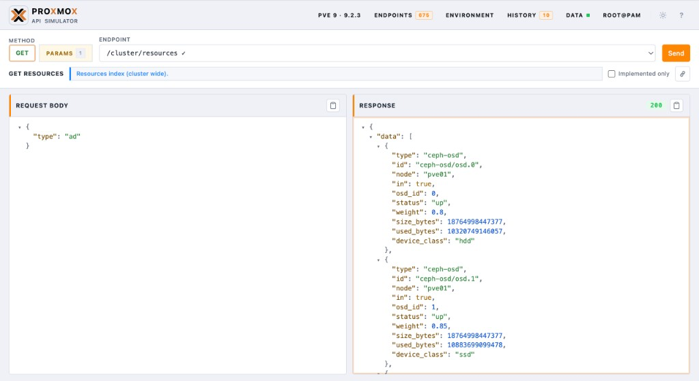
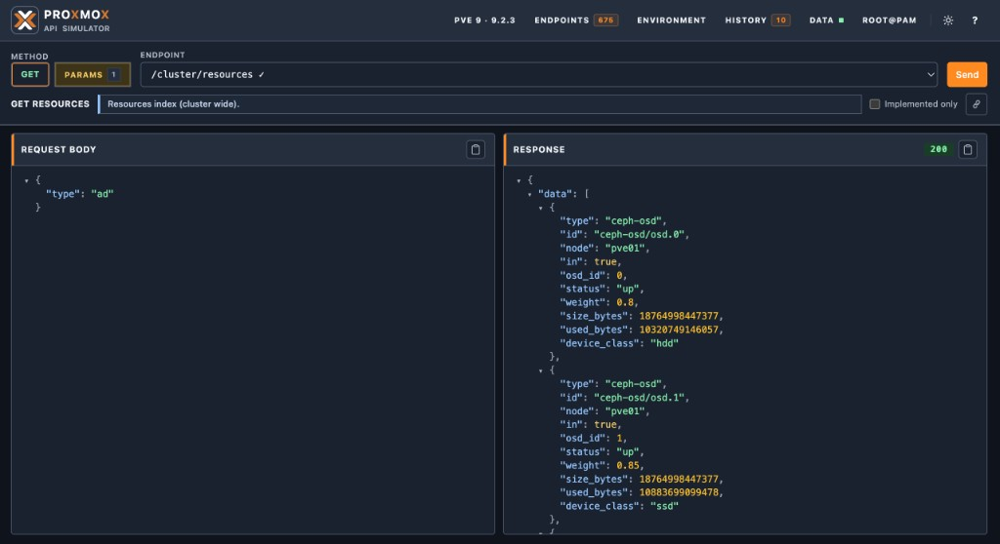

**Language / Язык:** [English](../web-ui.md) | [Русский](web-ui.md)

# Web UI

Откройте [http://localhost:8006/](http://localhost:8006/) после `make up`.

UI — лабораторная консоль симулятора, а не полноценный интерфейс управления Proxmox VE.
Поддерживаются светлая и тёмная темы, мажорные версии PVE **6–9**, редактирование
запросов/ответов, история и runtime apply контракта.

## Скриншоты

Светлая тема — `GET /cluster/resources` на PVE 9.2.3:

Тёмная тема — та же консоль с переключателем темы:

## Возможности

- Дерево эндпоинтов и выбор метода по выбранному мажору каталога
- Параметры и примеры payload, производные от контракта
- Редактор запросов, просмотр ответов и история
- Вход по паролю с обработкой cookie + CSRF
- Сводка окружения (runtime-версия, узлы, гости, storage)
- Превью curl / запросов
- Каталог API PVE **6–9** с покрытием реализации
- **Apply as runtime** — горячая замена активного контракта
- Представления совместимости и готовности
- Загрузка / выгрузка / обновление demo-кластера
- Монитор задач UPID (кнопка в шапке → status / log / «From last response»;
  для опросов задач нужна аутентификация)
- Ссылка на OpenAPI по `/docs`

## Backend-хелперы

| Method | Path | Назначение |
|---|---|---|
| GET | `/ui/api/versions` | Мажорные версии каталога vs runtime |
| GET | `/ui/api/catalog?major=N` | Каталог для мажора 6–9 |
| GET | `/ui/api/method?...` | Метаданные одного метода |
| GET | `/ui/api/compatibility?major=N` | Payload покрытия |
| POST | `/ui/api/contract/apply?major=N` | Горячая замена runtime-контракта |
| GET | `/ui/api/demo/state` | Состояние demo-набора данных |
| POST | `/ui/api/demo/load` | Загрузить `demo-cluster` |
| POST | `/ui/api/demo/unload` | Выгрузить → `minimal` |

## Workflow версий

1. Выберите мажор **6 / 7 / 8 / 9** в каталоге.
2. Изучите методы и покрытие.
3. **Apply as runtime**, когда нужно, чтобы живые маршруты `/api2/*` соответствовали
   этому мажору.
4. Подтвердите через `/api2/json/version` и `/admin/compatibility`.

Горячая замена только в памяти; перезапуск восстанавливает `CONTRACT_SNAPSHOT`.
Подробнее: [Версии API](api-versions.md).

## Замечание по безопасности

UI и demo-эндпоинты предназначены для локальной разработки. В текущей сборке они не
защищены отдельным admin-токеном. Не выставляйте порт симулятора в недоверенные сети.
