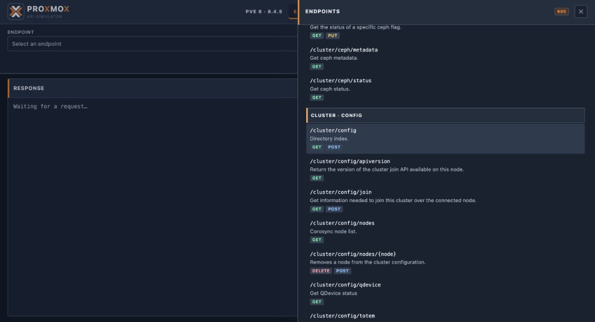
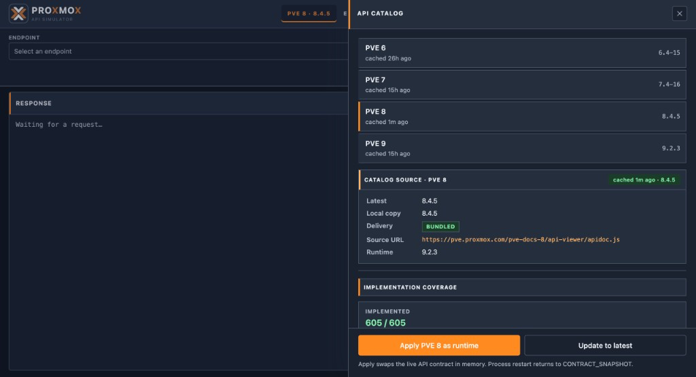
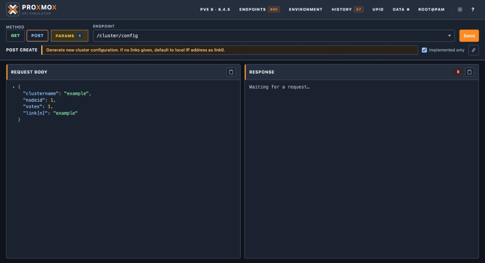
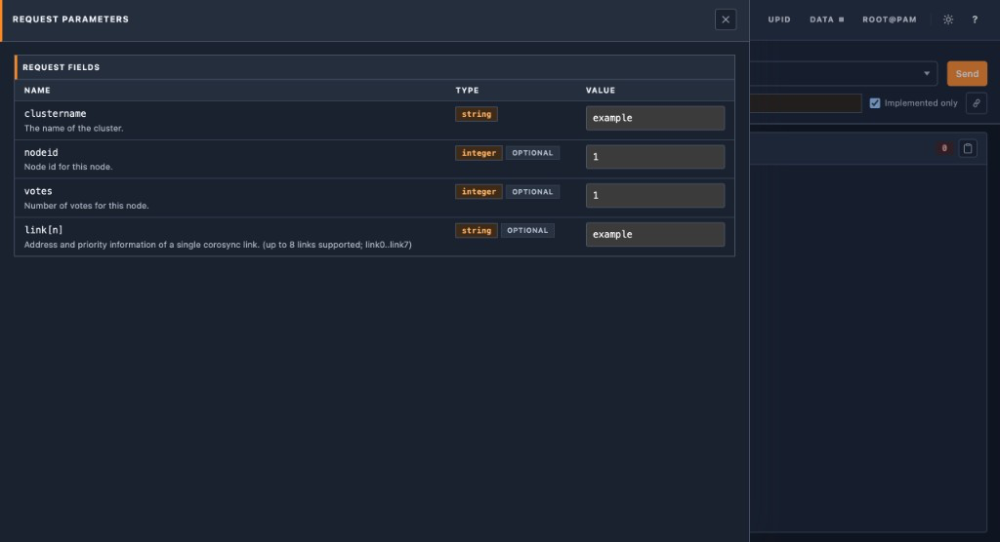
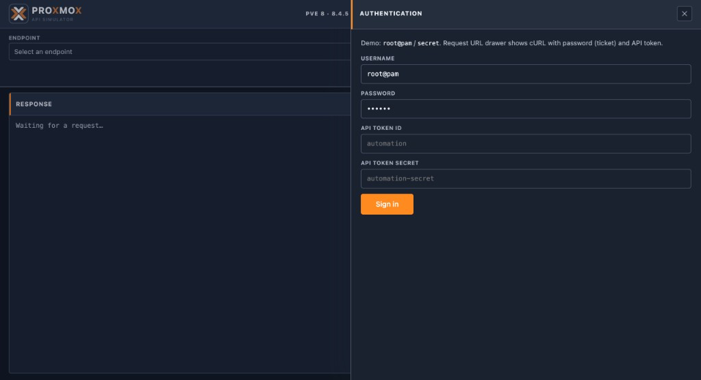
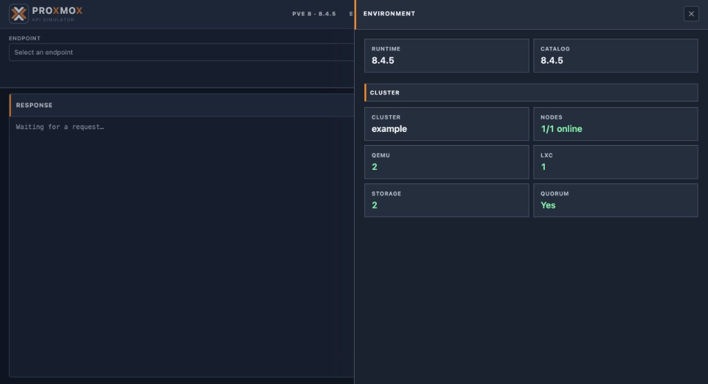
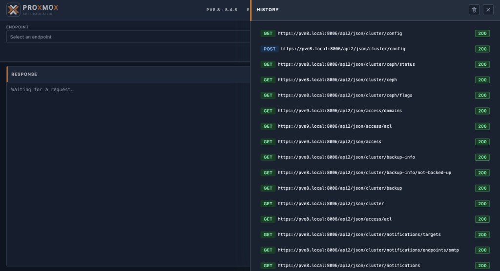
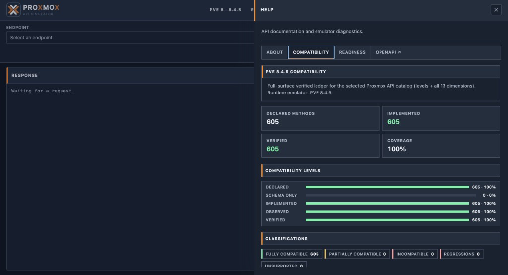
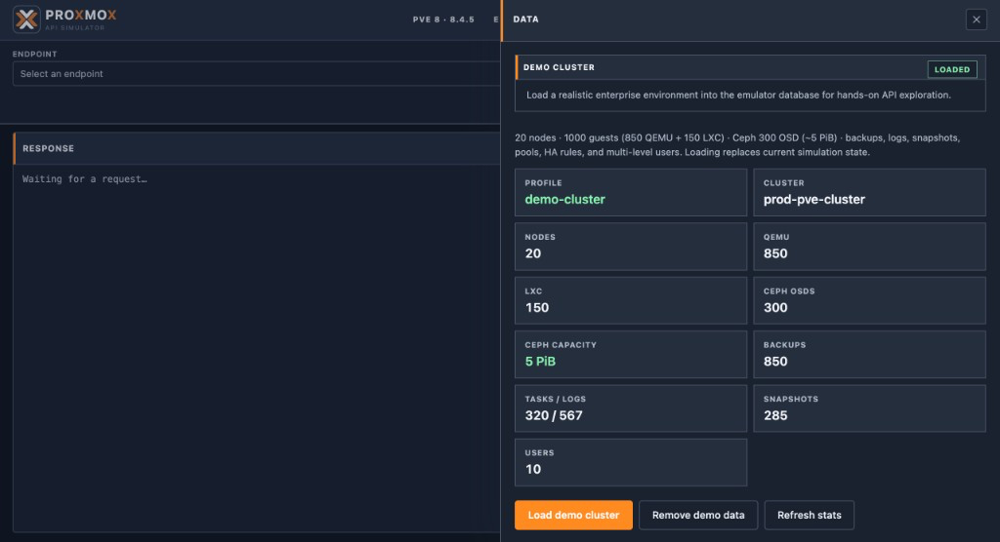
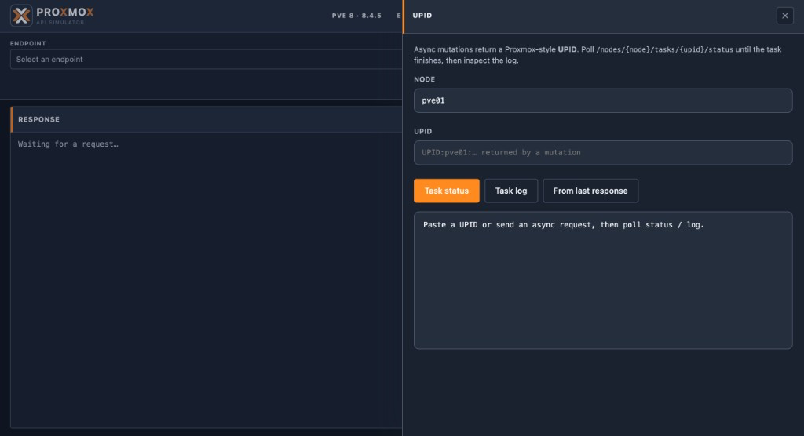

**Language / Язык:** [English](web-ui.md) | [Русский](ru/web-ui.md)

# Web UI

Open [http://localhost:8006/](http://localhost:8006/) after `make up`.

The UI is a laboratory console for the simulator — not a full Proxmox VE
management interface. It supports light and dark themes, PVE majors **6–9**,
request/response editing, history, and runtime contract apply.

## Screenshots

Console home (dark theme, PVE 8.4.5):

Light / dark themes:

Endpoints drawer (catalog methods for the selected major):

API catalog — majors 6–9, coverage, and **Apply as runtime**:

Request editor (`POST /cluster/config`):

Contract-derived request parameters:

Authentication (`root@pam` / API token):

Environment summary (runtime, cluster, guests):

Request history:

Help / compatibility ledger:

Demo-cluster load controls:

UPID task monitor:

## Features

- Endpoint tree and method selector driven by the selected catalog major
- Contract-derived parameters and example payloads
- Request editor, response viewer, and history
- Password login with cookie + CSRF handling
- Environment summary (runtime version, nodes, guests, storage)
- Curl / request previews
- PVE **6–9** API catalog with implementation coverage
- **Apply as runtime** hot-swap for the active contract
- Compatibility and readiness views
- Demo-cluster load / unload / refresh
- UPID task monitor (header control → status / log / “From last response”;
  requires login for authenticated task polls)
- Link to OpenAPI at `/docs`

## Backend helpers

| Method | Path | Purpose |
|---|---|---|
| GET | `/ui/api/versions` | Catalog majors vs runtime |
| GET | `/ui/api/catalog?major=N` | Catalog for major 6–9 |
| GET | `/ui/api/method?...` | Single method metadata |
| GET | `/ui/api/compatibility?major=N` | Coverage payload |
| POST | `/ui/api/contract/apply?major=N` | Hot-swap runtime contract |
| GET | `/ui/api/demo/state` | Demo dataset state |
| POST | `/ui/api/demo/load` | Load `demo-cluster` |
| POST | `/ui/api/demo/unload` | Unload → `minimal` |

## Version workflow

1. Pick major **6 / 7 / 8 / 9** in the catalog.
2. Inspect methods and coverage.
3. **Apply as runtime** when you want live `/api2/*` routes to match that major.
4. Confirm with `/api2/json/version` and `/admin/compatibility`.

Hot-swap is memory-only; restart restores `CONTRACT_SNAPSHOT`. Details:
[API versions](api-versions.md).

## Security note

UI and demo endpoints are intended for local development. They are not gated by
a separate admin token in the current build. Do not expose the simulator port to
untrusted networks.
